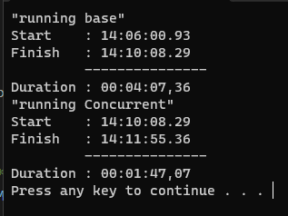

# Linear Regression with Go + Concurrency

## Project Summary

For 6 we were tasked with creating two models, running them 100x each and doing this concurrently and sequentially.     

For this project we leveraged the linear regression model from GoML. We created a Batch Gradient Ascent version and a Stochastic Gradient Ascent version.

We then leveraged some python to handle a small bit of EDA & ETL work to get the data in the right format for GoML. 

## Findings

Running the model 100 times resulted in the following

Doing a for loop, 1-100 the sequential runs took about 4 minutes.

Doing a for loop, 1-100 the concurrent version took about 1 minute 47 seconds.

## Go Setup

*./base/main.go:* \
This program located in the base folder ran both models sequentially 100 times.

*./concurrent/main.go:* \
This program located in the concurrent folder ran both models concurrently 100 times. To preserve calculations, we chunked out model 1 & model 2 sequences into separate go routines then used a waitgroup to make sure calculations were done on the right versions. This did not play a significant factor in this project, but for future deployments where parameters will be tweaked and results will be different, it'll be very important.

## References

https://github.com/cdipaolo/goml